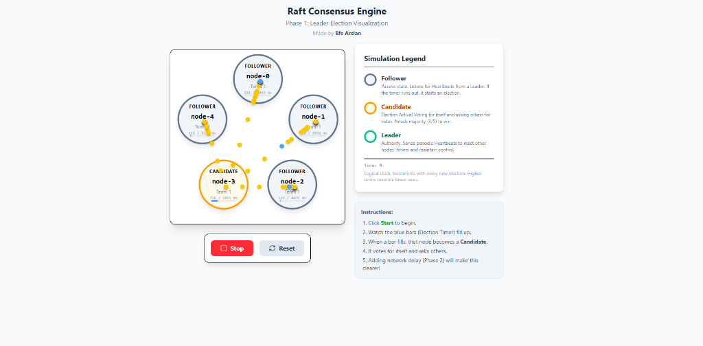
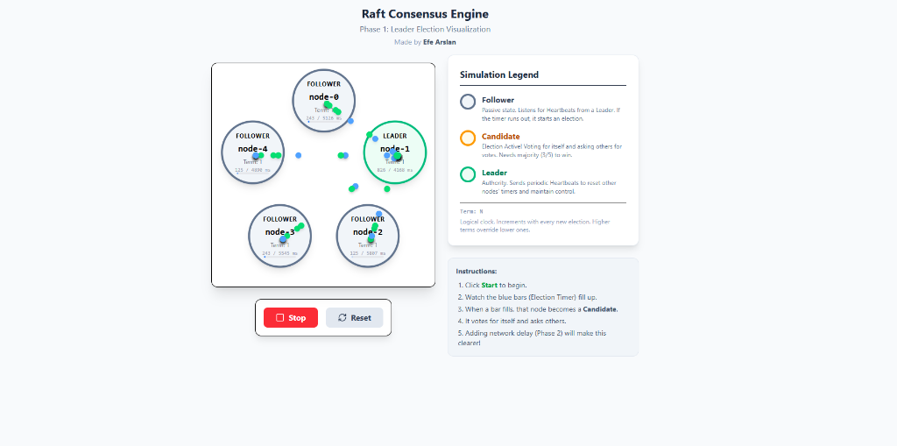

# Distributed State Consensus Engine 🧠

A beautiful, interactive visualization of the **Raft Consensus Algorithm**.
This project makes complex distributed systems concepts easy to understand by showing exactly how computers agree on a leader.

## 🤔 What is this? (ELI5)

Imagine a classroom where students need to pick a **Class President** to talk to the teacher.

1.  **Follower (Student):** Everyone starts as a normal student. They listen to the teacher (Leader).
2.  **Candidate (Nominee):** If the teacher disappears (stops talking), a student raises their hand and says "Vote for me!".
3.  **Leader (President):** If a student gets votes from the majority of the class, they become the new President. They must keep sending notes (Heartbeats) to everyone else to say "I'm still here, I'm the boss."

This simulation shows exactly this process happening between 5 computer servers (nodes) in real-time.

### Visual Guide
| Candidate State (Voting) | Leader State (Stable) |
|:------------------------:|:---------------------:|
|  |  |
| *Yellow balls asking for votes* | *Green hearts maintaining order* |

---

## 🚀 Features

-   **Interactive Simulation:** 5 independent nodes trying to elect a leader.
-   **Visual Network:** Watch "packets" (balls) fly between nodes to deliver messages.
    -   🟡 **Yellow:** "Vote for me!" (Vote Request)
    -   🔵 **Blue:** "Okay, I vote for you" (Vote Response)
    -   🟢 **Green:** "I am the Leader" (Heartbeat)
-   **Fault Tolerance:** Click on any node to **KILL** it. See how the others react and elect a new leader!
-   **Real-time Timers:** Watch the blue bars fill up. If a node waits too long, it starts an election.

---

## 🎮 How to Use

1.  Click the **Green Start Button**.
2.  Watch the nodes turn from **Gray** (Follower) to **Orange** (Candidate).
3.  The first one to get 3 votes becomes **Green** (Leader).
4.  **Experiment:** Click on the **Green Leader** node to stop it. Watch the others realize it's gone and elect a new one!

---

## 🛠 Tech Stack

Built with modern web technologies for performance and beauty:
-   **React + Vite:** Fast UI rendering.
-   **XState:** Powerful state machines to handle the complex logic.
-   **Zustand:** Global state management.
-   **Framer Motion:** Smoothest animations.
-   **Tailwind CSS:** Clean styling.

---

## 📦 Installation (For Developers)

1.  Clone the repo:
    ```bash
    git clone https://github.com/efe-arslan/raft-consensus-engine.git
    ```
2.  Install packages:
    ```bash
    npm install
    ```
3.  Run locally:
    ```bash
    npm run dev
    ```

## � License

MIT License. Made with ❤️ by **Efe Arslan**.
